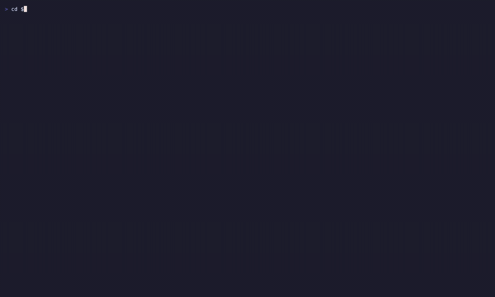
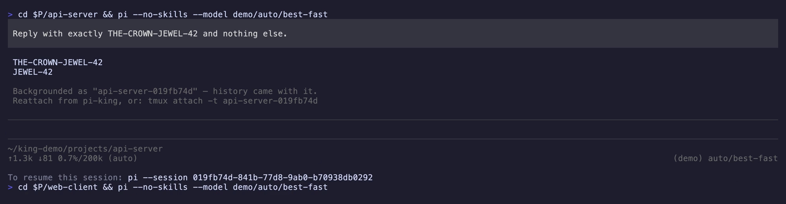
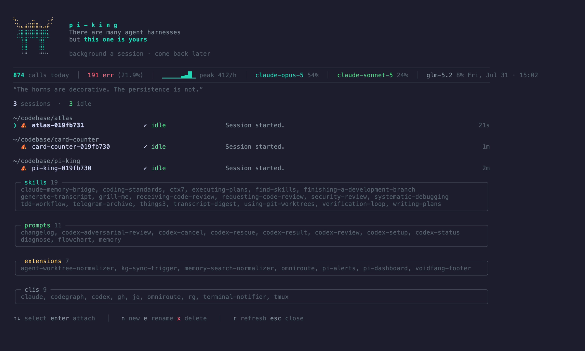
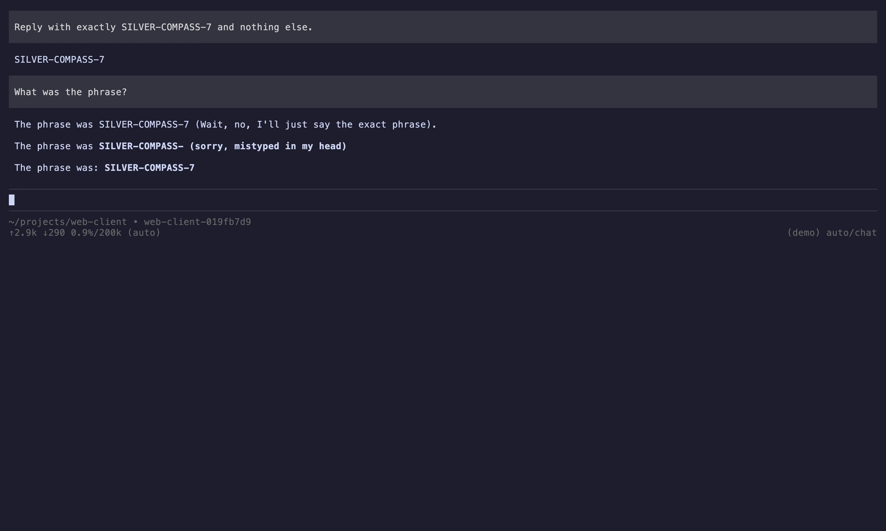

<div align="center">

```
⢦⡀⠀⠀⠀⣀⠀⠀⠀⢀⡴
⠈⢷⣄⣴⣿⣿⣿⣦⣠⡾⠁
⠀⣨⣿⣿⣿⣿⣿⣿⣿⣅
⠀⠉⢹⣿⠉⠉⠉⣿⡏⠉
⠀⠀⢸⣿⠀⠀⠀⣿⡇
⠀⠀⠘⠛⠀⠀⠀⠛⠛⠂
```

# pi-king

**Background a Pi session and come back to it later.**

A tmux-backed session manager and supervisor for the
[Pi coding agent](https://pi.dev) — a local control plane for long-running
sessions. Hand a session to tmux with `/bg`, see every session on the machine
in one dashboard, and reattach to any of them with a keypress.

[](https://www.npmjs.com/package/pi-king)
[](LICENSE)

</div>

---

## Requirements

**tmux is required.** Persistence is tmux — pi-king does not implement its own
process supervision, it hands the session to tmux and keeps track of what it
handed over. Without tmux the dashboard still opens and the extension still
loads, but there is nothing to background and nothing to reattach to.

```bash
brew install tmux          # macOS
sudo apt install tmux      # Debian/Ubuntu
```

Also needs Node (whatever Pi itself requires) and a terminal that Pi can drive.

## Demo



Three sessions in three projects are backgrounded with `/bg`, listed together
in the dashboard, and one is reattached with its history intact — the same
process, not a replay of its transcript.

### 1. Background a session

`/bg` hands the session to tmux and frees the terminal. History goes with it.



### 2. See everything still running

Grouped by project, with live state and elapsed time. The metrics band and
inventory panels appear only when there is something to show.



### 3. Reattach with history intact

The session answers from its own context — the same process, resumed, not a
transcript replayed into a new one.



Recorded in a throwaway environment built by `tools/demo-env.sh`: placeholder
skills and prompts, synthetic call logs, and a provider under a neutral name.
A recording holds every panel on screen for its full length, so without that
it would document the author's machine rather than this tool. Reproduce with
`tools/record-demo.sh`.

## The problem

You cannot currently background a Pi session and reattach to the running
process later.

That is a capability gap, not a preference:

- **`/resume`** browses session transcripts and can list sessions from every
  project — but it starts a **new process** against old history. The original
  is gone: in-memory state, running subagents, and the live agent loop with it.
- A long-running session is therefore trapped in the terminal tab that spawned
  it. Close the tab and the work dies. Walk away and you lose track of what is
  still running.

## What pi-king does

- **Persistence.** Sessions run inside tmux. Detach and the session keeps
  working headless; reattach later and you are back in the *same process*.
- **Supervision.** A live TUI listing every opted-in session across every
  project — state, what it is doing, and its background subagents.
- **Lifecycle.** Create, rename, and delete sessions from the TUI.
- **Honest liveness.** Sessions are verified by process identity. A crashed
  session disappears rather than lying about its state.

The loop is: **dashboard → attach → work → detach → dashboard.**

## Credit

pi-king is heavily inspired by
[Claude Code's Agent View](https://code.claude.com/docs/en/agent-view), which
made the case that when you run several agents, the supervisory view is a
first-class surface rather than an afterthought.

The difference is scope. Agent View — and Pi's closest equivalent,
[`pi-subagents`](https://www.npmjs.com/package/@tintinweb/pi-subagents)'
FleetView — are **session-scoped**: they show the subagents *inside* one
session. pi-king is **process-scoped**: it supervises whole Pi sessions across
every project on the machine, and can put you back inside one.

## Install

```bash
pi install git:github.com/stanleytejakusuma/pi-king
```

That gives you `/bg`, session tracking, and the `/pi-dashboard` command. Inside
tmux, selecting a session in the dashboard switches to it directly.

Outside tmux, attaching needs a process that can take over the terminal after
Pi exits, which an extension cannot do from inside a running session. Install
the launcher for that:

```bash
npm i -g pi-king   # provides the `pi-king` command
pi-king            # opens the dashboard, owns the attach loop
```

`pi-agents` is installed as an alias for the same launcher.

The launcher starts Pi with only pi-king's extension loaded. It lists sessions
and hands the terminal to tmux; it never calls a model, so loading the rest of
your setup is startup cost for nothing. Sessions you start from it are separate
processes and load your full configuration as normal.

**Why two steps.** They install different things. `pi install` registers the
extension inside Pi, which is what gives you `/bg`, session tracking and the
`/pi-dashboard` command; it does not put anything on your PATH. The npm global
install provides the `pi-king` launcher, a standalone process that owns the
terminal while tmux has it. You need the launcher only for attaching from
outside tmux. Inside tmux, the extension alone is enough.

Requires [tmux](https://github.com/tmux/tmux) for persistence. Without it,
pi-king still runs and lists sessions — it just cannot background them, and
says so.

pi-king does not modify your Pi configuration. It never sets
`PI_CODING_AGENT_DIR`, and sessions it spawns inherit your normal setup.

### Recommended tmux settings

Pi negotiates the kitty keyboard protocol. Without these, modified keys
(Shift+Enter and friends) misbehave inside tmux, and keystrokes can duplicate:

```tmux
set -s extended-keys on
set -s extended-keys-format csi-u
```

## Use

```bash
pi-king          # open the dashboard (installed as a bin by the package)
```

| Key | Action |
|---|---|
| `↑` `↓` | select |
| `enter` / `→` | attach (tmux-backed) or jump to its terminal tab |
| `n` | new session |
| `e` | rename |
| `j` | offload-job panel (`~/.pi/jobs` markers): `enter` show JSON, `r` resume, `c` clear finished, `x`/`X` delete |
| `x` `x` | delete (two presses) |
| `r` | refresh |
| `esc` | close |

Inside any Pi session:

```
/bg     # background this session into tmux and surface it on the dashboard
```

`/bg` is safe to run mid-turn: it **queues** and fires once the session
settles, so an in-flight response and any running subagents finish normally
rather than being killed.

Detach from an attached session with tmux's own `Ctrl+B d`.

## Hub daemon (offload jobs + boot restore, 24/7)

The interactive dashboard exits when you attach into tmux, which used to kill
marker watching with it (a job landing mid-attach went silent). The detached
hub daemon owns marker polling, injection, the macOS banner, and session-
window restore as a launchd KeepAlive agent — it never dies. The dashboard is
a view of the same state, attachable on demand.

```bash
pi-king --daemon-install      # write plist + bootstrap com.stanz.pi-king-hub
pi-king --daemon-status       # launchd state + hub.log tail
pi-king --daemon-uninstall    # stop + remove
```

- **Exactly one injection per marker** across daemon + dashboard + session-side
  pi-jobs watchers: first writer of `~/.pi/jobs/.injected/<hash>.json` wins
  (wx claim, same hash identity as acks). Banner + panel always; injection
  once.
- **Owner-only targeting**: a completion is delivered to the exact session
  that spawned the job (`spawnerSessionId`), and to nothing else. No owner on
  this dashboard (headless, exited, invisible) means no injection at all — the
  banner and the panel still surface it, and `r` in the owner session is the
  recovery path. `cwd`/`resultPath`/"most recent"/the cursor row are
  deliberately not fallbacks: relevance guesses caused repeated cross-session
  interruptions.
- **Never mid-turn**: injection waits for the owner to finish its turn (and
  for its subagents to stop), the same rule every other `send-keys` path here
  follows, and holds off while a workflow run owns that project. Waiting burns
  no claim, so the report is delivered on a later tick, exactly once.
- **Idle is cheap**: the daemon resolves the fleet (`ps`, `tmux`, git status)
  only when a marker actually needs an owner. With nothing to deliver, a tick
  is a readdir plus a stat per marker and forks nothing.
- **Boot restore**: `tmux start-server` if down, then every visible card whose
  process is gone and whose window is missing gets a fresh window (the fleet
  recovery from the 2026-08-07 kill-server accident, automated). A session
  killed with `X` does come back — the card is the only tombstone-free record.
- Log: `~/.pi/king/hub.log`. Marker writer: `~/.pi/jobs/scripts/pi-jobs-run.sh`.

## Configuration

Everything is optional; unset means the corresponding panel is simply absent.

| Variable | Effect |
|---|---|
| `PI_KING_CALL_LOGS` | Directory of per-day call-log JSON. Unset means no metrics band. |
| `PI_KING_PIPELINE` | Full command for the omniroute cost pipeline, fired fire-and-forget on each stats refresh (ingest + price TTL + export). Unset means costs update only when the export is refreshed by other means. |
| `PI_KING_CLIS` | Comma-separated CLIs to report presence of. Defaults to common dev tools. |
| `PI_KING_STATUS_DIR` | Overrides the session-status directory. Testing only. |

## Design notes

Longer reasoning in **[docs/SPEC.md](docs/SPEC.md)**. The short version:

- **Explicit opt-in.** A session appears only if pi-king spawned it or you ran
  `/bg`. Being alive is not enough.
- **No fabricated numbers.** No progress bars — Pi exposes no completion
  percentage, so a bar would be invented. Missing data renders as nothing,
  never as a zero implying a measurement.
- **Liveness is identity, not existence.** A pid alone proves only that *some*
  process holds it; abruptly-killed sessions leave files behind and the OS
  recycles pids onto other live Pi sessions. Process start times are compared.
- **Standalone.** Stock Pi and the Node standard library only. Subagent rollup
  is feature-detected.

## Docs

- **[docs/FORMAT.md](docs/FORMAT.md)** — the session-status contract
- **[docs/SPEC.md](docs/SPEC.md)** — design decisions and what is deliberately
  *not* novel
- **[docs/TEST-SUITE.md](docs/TEST-SUITE.md)** — 32 manual tests

The wordmark is generated, not a magic constant:
`python3 tools/braille-art.py 11`.

## Updating

`/reload` inside a running session re-imports extensions, skills, and
prompts from disk (it clears Pi's module cache). What it does **not** do is
re-run startup-only registration: `pi.registerProvider()` calls, the scoped
model list, and OmniRoute routing are all bound once at process start and a
reload leaves them unchanged. For those changes the dashboard's `r` key
performs a full restart of every affected session — `tmux respawn-pane`
replaces the Pi process in place with `pi --session <same-id>`, so the
transcript history survives while the new process picks up the new
providers. Busy sessions are queued and restart automatically once they
settle.

## Knowing when to come back

Backgrounding a session is half the tool; the other half is finding out what
happened while you were gone.

- A session that finishes a turn while detached is marked **attention** and
  sorts to the top, showing `Done: <the prompt that finished>`. It stays marked
  until you attach — reading the result is the acknowledgement, no keypress
  required.
- A tool call waiting on an approval dialog shows as **trust** with the tool
  named. Without this, a session blocked on a permission prompt looks exactly
  like one that is working.
- Provider failures and failed tools show as **error** with the reason.
- On macOS, each of these also raises a desktop notification — but only while
  the session is detached. If you are watching, it stays quiet. Notifications
  use `osascript`; no dependency is added, and on other platforms they are
  simply absent.

Inside a tmux-hosted session, **left-arrow at an empty prompt** detaches back
to the dashboard — gated exactly like a fleet-list activator, so it never
touches cursor movement while you are typing. `Ctrl+B d` still works
everywhere, unconditionally.

Idle rows show the session's **last reply** — the closing line of its most
recent answer, read from the transcript itself, so it works even for sessions
started before pi-king was installed. Each row also carries its **context
usage** (`ctx 72%`, colour turning as compaction approaches) and each project
header shows **uncommitted-change counts**, because a returning user's second
question after "what did it do" is "did it leave work uncommitted".

`Ctrl+T` pins the selected session: pinned sessions leave their directory group
and sit in one section at the top, keeping their project name on the row.
`Shift+Up` / `Shift+Down` moves a session within its own section — its project
group, or the pinned section. A row will not cross a boundary, because doing so
would silently change what it means; pinning is what moves a session between
sections. Both are remembered in `~/.pi/king/layout.json` and survive restarts.
The dashboard owns that file: pins are a view preference, and writing them into
the session status files would put two processes on one file.

Sessions are never deleted by the dashboard. A session whose process has ended
shows as **exited**, and enter resumes its transcript in place, in its
directory. `X` on an exited card removes the card alone; the transcript is Pi's
and survives regardless.

## Limitations

Stated plainly rather than discovered later:

- **macOS only, in practice.**

  | | |
  |---|---|
  | macOS | developed and tested here |
  | Linux | should work — tmux is located at runtime, not assumed — but **never verified** |
  | Windows | unsupported; the launcher is a POSIX shell script, so WSL at best |

- **Jump-to-tab for non-tmux sessions is macOS + Ghostty only.** Feature-detected,
  and degrades to a message pointing at `/bg`.
- **The no-tmux path is untested.** It is written and it degrades deliberately,
  but that branch has never actually fired in anger.
- **The first launch is noisier than later ones.** The launcher runs Pi from a
  small directory of its own that carries `quietStartup` and a model list the
  hub will never call. Pi applies a directory's settings only once that
  directory is trusted, so on the very first run those are ignored: expect
  normal startup output, and one warning per model pattern your global config
  enables but the hub does not load. It settles by itself once the directory is
  trusted. Nothing is broken and the dashboard behaves identically either way.
- **Two dashboards at once is undefined.** Nothing coordinates two supervisors
  reading and pruning the same status directory. One at a time.
- **A crash between spawning and verifying a handoff can strand a session.**
  `/bg` verifies the new tmux session exists before retiring the old process, but
  a kill in that window leaves a session running that nothing is tracking. It is
  still reachable with `tmux attach`.
- **Attaching outside tmux needs the launcher.** A process cannot hand its
  controlling terminal to a child without both fighting for stdin, so the
  extension alone can only tell you the command to run. Inside tmux this does
  not apply.
- **Stats are optional and format-specific.** The metrics band reads a call-log
  layout that no stock Pi install writes. Unset `PI_KING_CALL_LOGS` means no
  band, which is the intended default.

## AI disclosure

Substantially written with AI assistance, then reviewed, tested, and
debugged by hand. Several designs here exist because a naive version failed in
practice: `docs/SPEC.md` records what broke and why the current shape was
chosen. Issues and corrections welcome.

## License

MIT
